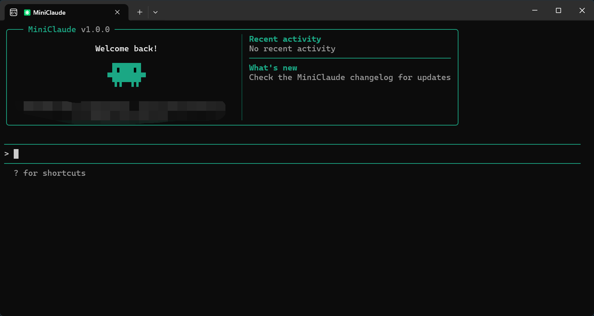

<p align="center">
  
</p>

<h1 align="center">MiniClaude</h1>

<p align="center">
  <strong>轻量级本地 AI 编程助手</strong><br>
  基于 Claude Code 精简改造，移除云服务依赖，专注本地开发体验<br>
  一个二进制文件，零云端回调
</p>

---

## 快速安装

### Windows

```bash
# 克隆仓库
git clone https://github.com/txl16095/MiniClaude.git
cd MiniClaude

# 配置环境变量
copy .env.example .env
# 编辑 .env 文件，填入你的 API 密钥

# 安装 Bun（如果尚未安装）
# 访问 https://bun.sh 下载 Windows 安装程序

# 构建项目
bun run build

# 运行
start.bat
```

### Linux / macOS

```bash
# 克隆仓库
git clone https://github.com/txl16095/MiniClaude.git
cd MiniClaude

# 配置环境变量
cp .env.example .env
# 编辑 .env 文件，填入你的 API 密钥

# 安装 Bun（如果尚未安装）
curl -fsSL https://bun.sh/install | bash

# 构建项目
bun run build

# 运行
./cli
```

---

## 目录

- [项目简介](#项目简介)
- [精简化改动](#精简化改动)
- [系统要求](#系统要求)
- [构建](#构建)
- [使用方法](#使用方法)
- [项目结构](#项目结构)
- [技术栈](#技术栈)
- [贡献](#贡献)
- [许可证](#许可证)

---

## 项目简介

MiniClaude 是基于 [free-code](https://github.com/paoloanzn/free-code) 进行深度精简改造的轻量级 AI 编程助手。

free-code 是从 Anthropic 的 [Claude Code](https://docs.anthropic.com/en/docs/claude-code) CLI 源代码重建的版本。原始源代码于 2026 年 3 月 31 日通过 npm 发行版的 source map 意外暴露而被公开。

本项目在 free-code 基础上删除了约 29,000 行云服务相关代码，专注于打造一个纯粹的本地 CLI 工具。

---

## 精简化改动

### 已删除的功能

| 类别 | 功能模块 | 代码行数 | 状态 |
|------|---------|---------|------|
| **云服务集成** | OAuth 认证系统 | ~2,062 行 | ✅ 已删除 |
| | 遥测和分析系统 | ~2,882 行 | ✅ 已删除 |
| | 设置同步和团队内存同步 | ~1,619 行 | ✅ 已删除 |
| | 策略限制检查 | ~610 行 | ✅ 已删除 |
| **远程和协作** | 远程控制功能 | ~1,619 行 | ✅ 已删除 |
| | 协调器模式 | ~490 行 | ✅ 已删除 |
| | 团队和协作功能 | ~9,665 行 | ✅ 已删除 |
| | 桥接模式 | - | ⏸️ 保留（与 TUI 深度耦合） |
| **实验性功能** | 语音模式 | ~500 行 | ✅ 已删除 |
| | 桌面端集成 | ~300 行 | ✅ 已删除 |
| | 移动端集成 | ~200 行 | ✅ 已删除 |
| | Stickers 装饰性 UI | ~150 行 | ✅ 已删除 |
| | Buddy/Companion 宠物精灵 | ~800 行 | ✅ 已删除 |
| **复杂集成** | Slack 集成 | ~30 行 | ✅ 已删除 |
| | Teleport 功能 | ~2,071 行 | ✅ 已删除 |
| | 自动更新系统 | ~1,069 行 | ✅ 已删除 |
| | Chrome 扩展订阅检查 | - | ✅ 移除限制（保留功能） |
| **命令清理** | 授权命令 | 5 个命令 | ✅ 已删除 |
| | 内部命令 | 22 个命令 | ✅ 已删除 |

### 保留的核心功能

| 功能模块 | 说明 |
|---------|------|
| AI 对话和代码生成 | 核心 AI 交互功能 |
| 文件读写操作 | 本地文件系统操作 |
| Shell 命令执行 | 执行系统命令 |
| Git 集成 | 版本控制集成 |
| MCP 支持 | Model Context Protocol |
| 插件系统 | 扩展功能支持 |
| 技能系统 | 可复用的 AI 技能 |
| Chrome 扩展集成 | 本地 MCP 通信 |
| GitHub 集成 | GitHub API 集成 |
| 权限系统 | 核心安全功能 |

### 精简化统计

| 指标 | 数量 |
|------|------|
| 删除文件 | ~166 个 |
| 创建占位文件 | ~59 个 |
| 净减少代码 | ~29,014 行 |
| 删除命令 | 27 个 |
| 删除依赖 | 20 个 |

---

## 系统要求

- **运行时**：[Bun](https://bun.sh) >= 1.3.11
- **操作系统**：Windows、macOS 或 Linux
- **认证**：所选模型提供商的 API key

### 安装 Bun

**Windows**：访问 https://bun.sh 下载安装程序

**Linux / macOS**：
```bash
curl -fsSL https://bun.sh/install | bash
```

### 配置环境变量

1. 复制 `.env.example` 为 `.env`：
   ```bash
   # Windows
   copy .env.example .env
   
   # Linux/macOS
   cp .env.example .env
   ```

2. 编辑 `.env` 文件，填入你的 API 密钥：
   ```bash
   ANTHROPIC_AUTH_TOKEN=your-api-key-here
   ```

3. （可选）配置其他设置，如自定义 API 端点、模型等

---

## 构建

### 基本构建

```bash
# 克隆仓库
git clone https://github.com/txl16095/MiniClaude.git
cd MiniClaude

# 构建项目
bun run build

# 运行
./cli  # Linux/macOS
# 或
start.bat  # Windows
```

### 构建变体

| 命令 | 输出 | 说明 |
|---|---|---|
| `bun run build` | `./cli` | 生产版本 |
| `bun run build:dev` | `./cli-dev` | 开发版本 |
| `bun run compile` | `./dist/cli` | 备用输出路径 |

---

## 使用方法

### 基本用法

```bash
# 交互式 REPL（默认）
./cli

# 单次命令模式
./cli -p "这个目录下有哪些文件？"

# 指定模型
./cli --model claude-sonnet-4-6

# 从源代码运行（启动较慢）
bun run dev
```

### 常用命令

- `/help` - 显示帮助信息
- `/clear` - 清空对话历史
- `/config` - 配置设置
- `/model` - 切换模型
- `/chrome` - Chrome 扩展集成
- `/mcp` - MCP 服务器管理
- `/skills` - 技能管理
- `/tasks` - 任务管理

### 环境变量

| 变量 | 用途 |
|---|---|
| `ANTHROPIC_API_KEY` | Anthropic API 密钥 |
| `ANTHROPIC_MODEL` | 覆盖默认模型 |
| `ANTHROPIC_BASE_URL` | 自定义 API 端点 |

---

## 项目结构

```
scripts/
  build.ts                # 构建脚本和功能标志系统

src/
  entrypoints/cli.tsx     # CLI 入口点
  commands.ts             # 命令注册表（斜杠命令）
  tools.ts                # 工具注册表（AI 工具）
  QueryEngine.ts          # LLM 查询引擎
  screens/REPL.tsx        # 主交互界面（Ink/React）

  commands/               # 斜杠命令实现
  tools/                  # AI 工具实现（Bash、Read、Edit 等）
  components/             # Ink/React 终端 UI 组件
  hooks/                  # React hooks
  services/               # API 客户端、MCP、OAuth
    api/                  # API 客户端
  state/                  # 应用状态存储
  utils/                  # 工具函数
    model/                # 模型配置、提供商、验证
  skills/                 # 技能系统
  plugins/                # 插件系统
  tasks/                  # 后台任务管理
```

---

## 技术栈

| 技术 | 说明 |
|---|---|
| **运行时** | [Bun](https://bun.sh) |
| **语言** | TypeScript |
| **终端 UI** | React + [Ink](https://github.com/vadimdemedes/ink) |
| **CLI 解析** | [Commander.js](https://github.com/tj/commander.js) |
| **模式验证** | Zod v4 |
| **代码搜索** | ripgrep（内置）|
| **协议** | MCP、LSP |
| **API** | Anthropic Messages、AWS Bedrock、Google Vertex AI |

---

## 贡献

欢迎贡献代码！

1. Fork 本仓库
2. 基于 `dev` 分支创建功能分支 (`git checkout -b feat/my-feature`)
3. 提交更改 (`git commit -m 'feat: add something'`)
4. 推送到你的 Fork (`git push origin feat/my-feature`)
5. 创建 Pull Request 到 `dev` 分支

**注意**：请将 PR 提交到 `dev` 分支，而不是 `main` 分支。

---

## 免责声明

**重要提示：请仔细阅读以下免责声明**

1. **版权归属**：本项目基于的原始 Claude Code 源代码版权归 Anthropic PBC 所有。

2. **非官方项目**：本项目（MiniClaude）不是 Anthropic 的官方项目，未经 Anthropic 授权或认可。

3. **源代码来源**：原始源代码是通过 Anthropic 的 npm 发行版中的 source map 意外暴露而获得的，并非 Anthropic 主动开源。

4. **使用风险**：
   - 使用本项目需自行承担风险
   - 本项目可能违反 Anthropic 的服务条款
   - Anthropic 可能随时要求停止使用或分发
   - 不保证功能的稳定性和安全性

5. **法律责任**：
   - 使用者应自行了解并遵守所在地区的法律法规
   - 项目维护者不对使用本项目造成的任何损失负责
   - 如有法律纠纷，责任由使用者自行承担

6. **商业使用**：不建议将本项目用于商业用途，可能存在法律风险。

7. **随时下架**：如果 Anthropic 提出要求，本项目将立即停止维护并删除所有相关代码。

**如果您不同意以上条款，请勿使用本项目。**

---

## 许可证

原始 Claude Code 源代码的版权归 Anthropic PBC 所有。本项目的存在是因为源代码通过 npm 发行版意外公开暴露。

本项目基于 free-code 改造，仅供学习和研究使用。使用时请自行斟酌法律风险。

---

## 更新日志

本项目基于 free-code 进行了大量精简改造，删除了约 29,000 行云服务相关代码。详细的改动记录请查看 Git 提交历史。

---

## 相关链接

- [free-code 项目](https://github.com/paoloanzn/free-code) - 上游项目
- [Claude Code 官方文档](https://docs.anthropic.com/en/docs/claude-code)
- [Anthropic 官网](https://www.anthropic.com)
- [Bun 官网](https://bun.sh)
