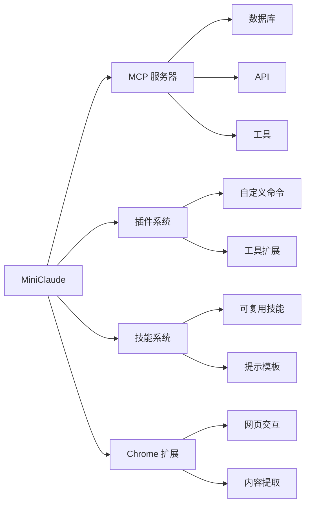

<div align="center">

```
███╗   ███╗██╗███╗   ██╗██╗     ██████╗██╗      █████╗ ██╗   ██╗██████╗ ███████╗
████╗ ████║██║████╗  ██║██║    ██╔════╝██║     ██╔══██╗██║   ██║██╔══██╗██╔════╝
██╔████╔██║██║██╔██╗ ██║██║    ██║     ██║     ███████║██║   ██║██║  ██║█████╗  
██║╚██╔╝██║██║██║╚██╗██║██║    ██║     ██║     ██╔══██║██║   ██║██║  ██║██╔══╝  
██║ ╚═╝ ██║██║██║ ╚████║██║    ╚██████╗███████╗██║  ██║╚██████╔╝██████╔╝███████╗
╚═╝     ╚═╝╚═╝╚═╝  ╚═══╝╚═╝     ╚═════╝╚══════╝╚═╝  ╚═╝ ╚═════╝ ╚═════╝ ╚══════╝
```

### 轻量级本地 AI 编程助手

**一个二进制 · 零云端 · 纯本地**

[](https://bun.sh)
[](https://www.typescriptlang.org/)
[](LICENSE)

[官网](https://txl16095.github.io/MiniClaude/) • [文档](#使用指南) • [快速开始](#快速开始) • [社区](https://github.com/txl16095/MiniClaude/discussions)

**语言 / Languages:** **中文** | [English](README_EN.md)

</div>

---

## ▸ 为什么选择 MiniClaude？

<table>
<tr>
<td width="50%">

### **[精简]** 极致精简
```
原版 Claude Code
    ↓ 删除 92,000 行
MiniClaude
```
移除所有云服务代码  
保留 100% 核心功能

</td>
<td width="50%">

### **[安全]** 完全本地
```
你的代码 → MiniClaude → AI
         ↑____________↓
         本地处理，零上传
```
无遥测 · 无追踪 · 无同步

</td>
</tr>
<tr>
<td width="50%">

### **[快速]** 开箱即用
```bash
$ bun run build
$ ./cli
> 你好！
```
一个命令，立即开始

</td>
<td width="50%">

### **[完整]** 功能完整
```
✓ AI 对话      ✓ 代码生成
✓ 文件操作     ✓ Git 集成
✓ MCP 协议     ✓ 插件系统
```
开发所需，应有尽有

</td>
</tr>
</table>

---

## ▸ 快速开始

### 一键安装

```bash
# [1] 克隆项目
git clone https://github.com/txl16095/MiniClaude.git && cd MiniClaude

# [2] 配置密钥
cp .env.example .env  # 编辑填入 ANTHROPIC_API_KEY

# [3] 构建运行
bun run build && ./cli
```

<details>
<summary><b>▸ 详细安装步骤</b></summary>

#### 安装 Bun

```bash
# macOS / Linux
curl -fsSL https://bun.sh/install | bash

# Windows
# 访问 https://bun.sh 下载安装程序
```

#### 配置环境

```bash
# 复制配置文件
cp .env.example .env

# 编辑 .env，添加你的 API 密钥
ANTHROPIC_API_KEY=sk-ant-xxxxx
```

#### 构建项目

```bash
bun install    # 安装依赖
bun run build  # 构建
./cli          # 运行
```

</details>

---

## ▸ 核心功能

<div align="center">

### AI 能力

</div>

| 功能 | 说明 | 示例 |
|:---:|:---|:---|
| **对话** | 智能对话 | 自然语言交互，理解上下文 |
| **生成** | 代码生成 | 创建、修改、重构代码 |
| **理解** | 项目理解 | 自动分析项目结构 |
| **模型** | 多模型支持 | Sonnet / Opus / Haiku |

<div align="center">

### 文件工具

</div>

```
┌─────────────┬──────────────────────────────────────┐
│ FileRead    │ 读取文件，支持语法高亮               │
│ FileWrite   │ 创建/覆盖文件                        │
│ FileEdit    │ 智能编辑，精确修改指定行             │
│ Glob        │ 文件搜索，支持通配符                 │
│ Grep        │ 内容搜索，基于 ripgrep               │
└─────────────┴──────────────────────────────────────┘
```

<div align="center">

### 开发集成

</div>

<table>
<tr>
<td align="center" width="25%">

**Shell**  
Bash / PowerShell  
命令执行

</td>
<td align="center" width="25%">

**Git**  
版本控制  
分支管理

</td>
<td align="center" width="25%">

**LSP**  
语言服务器  
代码补全

</td>
<td align="center" width="25%">

**Tasks**  
后台任务  
并行执行

</td>
</tr>
</table>

<div align="center">

### 扩展生态

</div>



---

## ▸ 与 Claude Code 的差异

<div align="center">

### 精简统计

</div>

```
┏━━━━━━━━━━━━━━━━━━━━━━━━━━━━━━━━━━━━━━━━━━━━━━━━━━━━━━━━━━━━━━━━━━━━━━━━┓
┃                                                                          ┃
┃   原版 Claude Code                                                       ┃
┃   ████████████████████████████████████████████████  100%                ┃
┃                                                                          ┃
┃   MiniClaude (删除 92,000 行)                                            ┃
┃   ████████████████████████                          20%                 ┃
┃                                                                          ┃
┃   ✓ 保留 100% 核心开发功能                                               ┃
┃   ✗ 移除 100% 云服务依赖                                                 ┃
┃                                                                          ┃
┗━━━━━━━━━━━━━━━━━━━━━━━━━━━━━━━━━━━━━━━━━━━━━━━━━━━━━━━━━━━━━━━━━━━━━━━━┛
```

<details>
<summary><b>▾ 已移除功能（点击展开）</b></summary>

### [云服务] 云服务集成 (~7,173 行)

| 模块 | 代码量 | 说明 |
|:---:|---:|:---|
| OAuth 认证 | 2,062 行 | 云端账号登录 |
| 遥测分析 | 2,882 行 | 使用数据上报 |
| 设置同步 | 1,619 行 | 跨设备配置同步 |
| 策略限制 | 610 行 | 企业策略检查 |

### [协作] 协作功能 (~24,387 行)

| 模块 | 代码量 | 说明 |
|:---:|---:|:---|
| 团队协作 | 9,665 行 | 多人协作编程 |
| 桥接模式 | 12,613 行 | 远程连接支持 |
| 远程控制 | 1,619 行 | 远程会话管理 |
| 协调器 | 490 行 | 多 Agent 协调 |

### [实验] 实验功能 (~1,950 行)

| 模块 | 代码量 | 说明 |
|:---:|---:|:---|
| 语音模式 | 500 行 | 语音交互 |
| 桌面集成 | 300 行 | 桌面应用 |
| 移动端 | 200 行 | 移动设备 |
| Buddy 精灵 | 800 行 | 宠物助手 |
| Stickers | 150 行 | 装饰贴纸 |

### [集成] 复杂集成 (~3,170 行)

| 模块 | 代码量 | 说明 |
|:---:|---:|:---|
| Teleport | 2,071 行 | 项目传送 |
| 自动更新 | 1,069 行 | 软件更新 |
| Slack | 30 行 | Slack 通知 |

### [云服务] 速率限制与计费 (~48,000 行)

| 模块 | 代码量 | 说明 |
|:---:|---:|:---|
| 速率限制系统 | 42,347 行 | 限速模拟/消息/处理链 |
| 用量分析 | 3,545 行 | 会话分析/用量追踪 |
| 文件云存储 | 748 行 | Anthropic 文件 API |
| 会话云同步 | 514 行 | 会话日志云端同步 |
| 其他云服务 | 1,400 行 | 引导/推荐/Grove/超审配额等 |

### [清理] 命令清理 (42 个)

```
授权命令 (5)    实验命令 (8)    内部命令 (22)    空桩命令 (4)
   login          ultraplan         tag            未实现
   logout         torch             agents         占位符
   auth           fork              platform       ...
   ...            ...               ...
```

</details>

<details>
<summary><b>▾ 保留功能（点击展开）</b></summary>

### 核心开发工具

```
┌─────────────────────────────────────────────────────────────┐
│                                                             │
│  ✓ AI 对话和代码生成      ✓ 文件读写编辑                   │
│  ✓ Shell 命令执行         ✓ Git 版本控制                   │
│  ✓ MCP 协议支持           ✓ LSP 语言服务                   │
│  ✓ 插件系统               ✓ 技能系统                       │
│  ✓ 任务管理               ✓ 权限控制                       │
│  ✓ Chrome 扩展            ✓ GitHub 集成                    │
│                                                             │
└─────────────────────────────────────────────────────────────┘
```

</details>

---

## ▸ 使用指南

### 常用命令

<table>
<tr>
<td width="50%">

#### [基础] 基础命令

```bash
/help              # 帮助信息
/clear             # 清空对话
/exit              # 退出程序
```

#### [配置] 配置命令

```bash
/config            # 打开配置
/model             # 切换模型
/theme             # 切换主题
```

</td>
<td width="50%">

#### [文件] 文件命令

```bash
/files             # 查看上下文
/add-dir <path>    # 添加目录
```

#### [工具] 工具命令

```bash
/mcp               # MCP 服务器
/skills            # 技能管理
/tasks             # 任务管理
/chrome            # Chrome 扩展
```

</td>
</tr>
</table>

### 环境变量

```bash
# API 配置
ANTHROPIC_API_KEY=sk-ant-xxx        # ← 必需
ANTHROPIC_BASE_URL=https://...      # 自定义端点
ANTHROPIC_MODEL=claude-sonnet-4-6   # 默认模型

# 代理配置
HTTP_PROXY=http://proxy:port
HTTPS_PROXY=https://proxy:port

# 调试选项
DEBUG=*                             # 启用调试
```

### 配置文件

```
~/.config/miniclaude/
├── config.json          # 主配置
├── settings.json        # 用户设置
├── mcp.json            # MCP 服务器
├── skills/             # 自定义技能
└── plugins/            # 自定义插件
```

---

## ▸ 项目结构

```
MiniClaude/
│
├── src/
│   ├── entrypoints/     # CLI 入口
│   ├── commands/        # 斜杠命令
│   ├── tools/           # AI 工具
│   ├── components/      # UI 组件
│   ├── services/        # 服务层
│   │   ├── api/         # API 客户端
│   │   ├── mcp/         # MCP 协议
│   │   └── lsp/         # LSP 协议
│   ├── utils/           # 工具函数
│   ├── skills/          # 技能系统
│   ├── plugins/         # 插件系统
│   └── state/           # 状态管理
│
├── scripts/
│   └── build.ts         # 构建脚本
│
├── website/             # 官网源码
│
└── README.md
```

---

## ▸ 技术栈

<div align="center">

| 技术 | 版本 | 用途 |
|:---:|:---:|:---|
|  | 1.3.11+ | 运行时和构建 |
|  | 6.0+ | 开发语言 |
|  | 19.x | UI 框架 |
|  | 4.x | 模式验证 |

</div>

---

## ▸ 贡献

<div align="center">

**欢迎贡献！让 MiniClaude 变得更好**

</div>

```bash
# 1. Fork 项目
# 2. 创建分支
git checkout -b feat/amazing-feature

# 3. 提交更改
git commit -m 'feat: add amazing feature'

# 4. 推送分支
git push origin feat/amazing-feature

# 5. 提交 PR 到 dev 分支
```

### 开发环境

```bash
bun install       # 安装依赖
bun run dev       # 开发模式
bun run build     # 构建
bun run build:dev # 开发构建
```

---

## ▸ 许可证

<div align="center">

**MIT License** © 2026 [txl16095](https://github.com/txl16095)

基于 [free-code](https://github.com/paoloanzn/free-code) 改造  
原始代码版权归 [Anthropic PBC](https://www.anthropic.com) 所有

</div>

---

## ▸ 免责声明

<div align="center">

```
┏━━━━━━━━━━━━━━━━━━━━━━━━━━━━━━━━━━━━━━━━━━━━━━━━━━━━━━━━━━━━━━━━━━━━━━━━┓
┃                                                                          ┃
┃  [!] 本项目不是 Anthropic 的官方项目，未经授权或认可                     ┃
┃                                                                          ┃
┃  [!] 使用本项目需自行承担风险，仅供学习和研究使用                         ┃
┃                                                                          ┃
┃  [!] 不建议用于商业用途，可能存在法律风险                                 ┃
┃                                                                          ┃
┃  [!] 如 Anthropic 要求，将立即停止维护                                   ┃
┃                                                                          ┃
┗━━━━━━━━━━━━━━━━━━━━━━━━━━━━━━━━━━━━━━━━━━━━━━━━━━━━━━━━━━━━━━━━━━━━━━━━┛
```

**如果您不同意以上条款，请勿使用本项目**

</div>

---

## ▸ 相关链接

<div align="center">

[](https://txl16095.github.io/MiniClaude/)
[](https://github.com/paoloanzn/free-code)
[](https://docs.anthropic.com/en/docs/claude-code)
[](https://www.anthropic.com)
[](https://bun.sh)

</div>

---

<div align="center">

**Made by [txl16095](https://github.com/txl16095)**

如果这个项目对你有帮助，请给个 Star！

</div>
