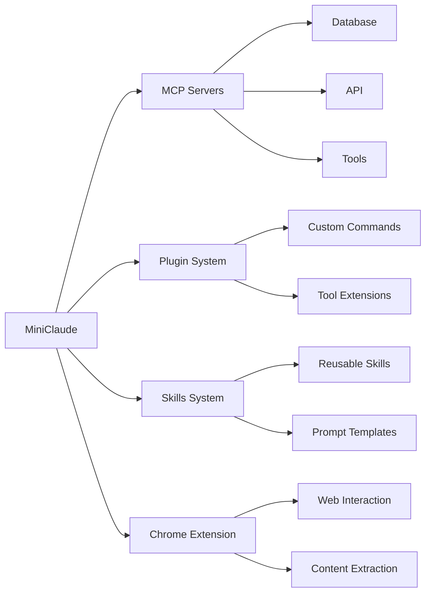

<div align="center">

```
███╗   ███╗██╗███╗   ██╗██╗     ██████╗██╗      █████╗ ██╗   ██╗██████╗ ███████╗
████╗ ████║██║████╗  ██║██║    ██╔════╝██║     ██╔══██╗██║   ██║██╔══██╗██╔════╝
██╔████╔██║██║██╔██╗ ██║██║    ██║     ██║     ███████║██║   ██║██║  ██║█████╗  
██║╚██╔╝██║██║██║╚██╗██║██║    ██║     ██║     ██╔══██║██║   ██║██║  ██║██╔══╝  
██║ ╚═╝ ██║██║██║ ╚████║██║    ╚██████╗███████╗██║  ██║╚██████╔╝██████╔╝███████╗
╚═╝     ╚═╝╚═╝╚═╝  ╚═══╝╚═╝     ╚═════╝╚══════╝╚═╝  ╚═╝ ╚═════╝ ╚═════╝ ╚══════╝
```

### Lightweight Local AI Coding Assistant

**One Binary · Zero Cloud · Pure Local**

[](https://bun.sh)
[](https://www.typescriptlang.org/)
[](LICENSE)

[Website](https://txl16095.github.io/MiniClaude/) • [Documentation](#usage-guide) • [Quick Start](#quick-start) • [Community](https://github.com/txl16095/MiniClaude/discussions)

**Languages:** [中文](README.md) | **English**

</div>

---

## ▸ Why Choose MiniClaude?

<table>
<tr>
<td width="50%">

### **[Minimal]** Extremely Simplified
```
Original Claude Code
    ↓ Removed 44,700 lines
MiniClaude
```
Removed all cloud service code  
Retained 100% core functionality

</td>
<td width="50%">

### **[Secure]** Fully Local
```
Your Code → MiniClaude → AI
         ↑____________↓
      Local processing, zero upload
```
No telemetry · No tracking · No sync

</td>
</tr>
<tr>
<td width="50%">

### **[Fast]** Ready to Use
```bash
$ bun run build
$ ./cli
> Hello!
```
One command, start immediately

</td>
<td width="50%">

### **[Complete]** Full-Featured
```
✓ AI Chat        ✓ Code Generation
✓ File Ops       ✓ Git Integration
✓ MCP Protocol   ✓ Plugin System
```
Everything you need for development

</td>
</tr>
</table>

---

## ▸ Quick Start

### One-Click Installation

```bash
# [1] Clone the project
git clone https://github.com/txl16095/MiniClaude.git && cd MiniClaude

# [2] Configure API key
cp .env.example .env  # Edit and add ANTHROPIC_API_KEY

# [3] Build and run
bun run build && ./cli
```

<details>
<summary><b>▸ Detailed Installation Steps</b></summary>

#### Install Bun

```bash
# macOS / Linux
curl -fsSL https://bun.sh/install | bash

# Windows
# Visit https://bun.sh to download installer
```

#### Configure Environment

```bash
# Copy configuration file
cp .env.example .env

# Edit .env, add your API key
ANTHROPIC_API_KEY=sk-ant-xxxxx
```

#### Build Project

```bash
bun install    # Install dependencies
bun run build  # Build
./cli          # Run
```

</details>

---

## ▸ Core Features

<div align="center">

### AI Capabilities

</div>

| Feature | Description | Example |
|:---:|:---|:---|
| **Chat** | Intelligent Conversation | Natural language interaction, context understanding |
| **Generate** | Code Generation | Create, modify, refactor code |
| **Understand** | Project Understanding | Automatic project structure analysis |
| **Models** | Multi-Model Support | Sonnet / Opus / Haiku |

<div align="center">

### File Tools

</div>

```
┌─────────────┬──────────────────────────────────────┐
│ FileRead    │ Read files with syntax highlighting  │
│ FileWrite   │ Create/overwrite files               │
│ FileEdit    │ Smart editing, precise line changes  │
│ Glob        │ File search with wildcards           │
│ Grep        │ Content search based on ripgrep      │
└─────────────┴──────────────────────────────────────┘
```

<div align="center">

### Development Integration

</div>

<table>
<tr>
<td align="center" width="25%">

**Shell**  
Bash / PowerShell  
Command Execution

</td>
<td align="center" width="25%">

**Git**  
Version Control  
Branch Management

</td>
<td align="center" width="25%">

**LSP**  
Language Server  
Code Completion

</td>
<td align="center" width="25%">

**Tasks**  
Background Tasks  
Parallel Execution

</td>
</tr>
</table>

<div align="center">

### Extension Ecosystem

</div>



---

## ▸ Differences from Claude Code

<div align="center">

### Simplification Statistics

</div>

```
┏━━━━━━━━━━━━━━━━━━━━━━━━━━━━━━━━━━━━━━━━━━━━━━━━━━━━━━━━━━━━━━━━━━━━━━━━┓
┃                                                                          ┃
┃   Original Claude Code                                                   ┃
┃   ████████████████████████████████████████████████  100%                ┃
┃                                                                          ┃
┃   MiniClaude (Removed 44,700 lines)                                      ┃
┃   ████████████████████████                          55%                 ┃
┃                                                                          ┃
┃   ✓ Retained 100% core development features                             ┃
┃   ✗ Removed 100% cloud service dependencies                             ┃
┃                                                                          ┃
┗━━━━━━━━━━━━━━━━━━━━━━━━━━━━━━━━━━━━━━━━━━━━━━━━━━━━━━━━━━━━━━━━━━━━━━━━┛
```

<details>
<summary><b>▾ Removed Features (Click to expand)</b></summary>

### [Cloud] Cloud Service Integration (~7,173 lines)

| Module | Lines | Description |
|:---:|---:|:---|
| OAuth Auth | 2,062 lines | Cloud account login |
| Telemetry | 2,882 lines | Usage data reporting |
| Settings Sync | 1,619 lines | Cross-device config sync |
| Policy Limits | 610 lines | Enterprise policy checks |

### [Collab] Collaboration Features (~24,387 lines)

| Module | Lines | Description |
|:---:|---:|:---|
| Team Collab | 9,665 lines | Multi-user coding |
| Bridge Mode | 12,613 lines | Remote connection support |
| Remote Control | 1,619 lines | Remote session management |
| Coordinator | 490 lines | Multi-agent coordination |

### [Experimental] Experimental Features (~1,950 lines)

| Module | Lines | Description |
|:---:|---:|:---|
| Voice Mode | 500 lines | Voice interaction |
| Desktop Integration | 300 lines | Desktop app |
| Mobile | 200 lines | Mobile devices |
| Buddy | 800 lines | Pet assistant |
| Stickers | 150 lines | Decorative stickers |

### [Integration] Complex Integrations (~3,170 lines)

| Module | Lines | Description |
|:---:|---:|:---|
| Teleport | 2,071 lines | Project teleportation |
| Auto Update | 1,069 lines | Software updates |
| Slack | 30 lines | Slack notifications |

### [Cleanup] Command Cleanup (39 commands)

```
Auth Commands (5)    Experimental (8)    Internal (22)    Stubs (4)
   login                ultraplan           tag            Not implemented
   logout               torch               agents         Placeholders
   auth                 fork                platform       ...
   ...                  ...                 ...
```

</details>

<details>
<summary><b>▾ Retained Features (Click to expand)</b></summary>

### Core Development Tools

```
┌─────────────────────────────────────────────────────────────┐
│                                                             │
│  ✓ AI chat and code generation    ✓ File read/write/edit   │
│  ✓ Shell command execution        ✓ Git version control    │
│  ✓ MCP protocol support           ✓ LSP language service   │
│  ✓ Plugin system                  ✓ Skills system          │
│  ✓ Task management                ✓ Permission control     │
│  ✓ Chrome extension               ✓ GitHub integration     │
│                                                             │
└─────────────────────────────────────────────────────────────┘
```

</details>

---

## ▸ Usage Guide

### Common Commands

<table>
<tr>
<td width="50%">

#### [Basic] Basic Commands

```bash
/help              # Help information
/clear             # Clear conversation
/exit              # Exit program
```

#### [Config] Configuration Commands

```bash
/config            # Open configuration
/model             # Switch model
/theme             # Switch theme
```

</td>
<td width="50%">

#### [Files] File Commands

```bash
/files             # View context
/add-dir <path>    # Add directory
```

#### [Tools] Tool Commands

```bash
/mcp               # MCP servers
/skills            # Skills management
/tasks             # Task management
/chrome            # Chrome extension
```

</td>
</tr>
</table>

### Environment Variables

```bash
# API Configuration
ANTHROPIC_API_KEY=sk-ant-xxx        # ← Required
ANTHROPIC_BASE_URL=https://...      # Custom endpoint
ANTHROPIC_MODEL=claude-sonnet-4-6   # Default model

# Proxy Configuration
HTTP_PROXY=http://proxy:port
HTTPS_PROXY=https://proxy:port

# Debug Options
DEBUG=*                             # Enable debugging
```

### Configuration Files

```
~/.config/miniclaude/
├── config.json          # Main configuration
├── settings.json        # User settings
├── mcp.json            # MCP servers
├── skills/             # Custom skills
└── plugins/            # Custom plugins
```

---

## ▸ Project Structure

```
MiniClaude/
│
├── src/
│   ├── entrypoints/     # CLI entry points
│   ├── commands/        # Slash commands
│   ├── tools/           # AI tools
│   ├── components/      # UI components
│   ├── services/        # Service layer
│   │   ├── api/         # API client
│   │   ├── mcp/         # MCP protocol
│   │   └── lsp/         # LSP protocol
│   ├── utils/           # Utility functions
│   ├── skills/          # Skills system
│   ├── plugins/         # Plugin system
│   └── state/           # State management
│
├── scripts/
│   └── build.ts         # Build script
│
├── website/             # Website source
│
└── README.md
```

---

## ▸ Tech Stack

<div align="center">

| Technology | Version | Purpose |
|:---:|:---:|:---|
|  | 1.3.11+ | Runtime and build |
|  | 6.0+ | Development language |
|  | 19.x | UI framework |
|  | 4.x | Schema validation |

</div>

---

## ▸ Contributing

<div align="center">

**Contributions welcome! Let's make MiniClaude better**

</div>

```bash
# 1. Fork the project
# 2. Create a branch
git checkout -b feat/amazing-feature

# 3. Commit changes
git commit -m 'feat: add amazing feature'

# 4. Push branch
git push origin feat/amazing-feature

# 5. Submit PR to dev branch
```

### Development Environment

```bash
bun install       # Install dependencies
bun run dev       # Development mode
bun run build     # Build
bun run build:dev # Development build
```

---

## ▸ License

<div align="center">

**MIT License** © 2026 [txl16095](https://github.com/txl16095)

Based on [free-code](https://github.com/paoloanzn/free-code)  
Original code copyright © [Anthropic PBC](https://www.anthropic.com)

</div>

---

## ▸ Disclaimer

<div align="center">

```
┏━━━━━━━━━━━━━━━━━━━━━━━━━━━━━━━━━━━━━━━━━━━━━━━━━━━━━━━━━━━━━━━━━━━━━━━━┓
┃                                                                          ┃
┃  [!] This project is not an official Anthropic project                  ┃
┃      and is not authorized or endorsed by Anthropic                     ┃
┃                                                                          ┃
┃  [!] Use at your own risk, for learning and research purposes only      ┃
┃                                                                          ┃
┃  [!] Not recommended for commercial use, may have legal risks           ┃
┃                                                                          ┃
┃  [!] Will cease maintenance immediately if requested by Anthropic       ┃
┃                                                                          ┃
┗━━━━━━━━━━━━━━━━━━━━━━━━━━━━━━━━━━━━━━━━━━━━━━━━━━━━━━━━━━━━━━━━━━━━━━━━┛
```

**If you do not agree with the above terms, please do not use this project**

</div>

---

## ▸ Related Links

<div align="center">

[](https://txl16095.github.io/MiniClaude/)
[](https://github.com/paoloanzn/free-code)
[](https://docs.anthropic.com/en/docs/claude-code)
[](https://www.anthropic.com)
[](https://bun.sh)

</div>

---

<div align="center">

**Made by [txl16095](https://github.com/txl16095)**

If this project helps you, please give it a Star!

</div>
